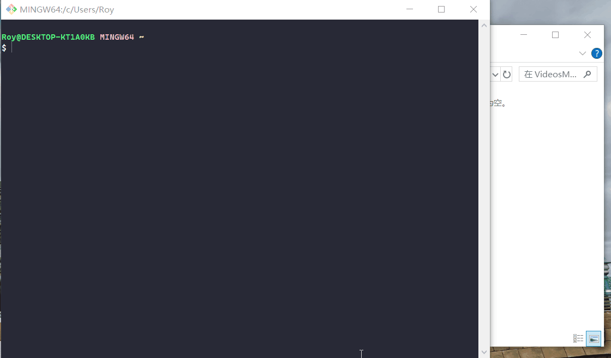

# ScreenRecorder-cli 🎬

[English](./README.md) | [中文](./README_zh.md) | [日本語](README_jp.md) | 한국어 | [Deutsch](./README_de.md) | [Français](./README_fr.md) | [Español](./README_es.md)

> ffmpeg 기반 크로스 플랫폼 CLI 화면 녹화 도구 —— 명령어 하나로 녹화 시작.

[](https://www.npmjs.com/package/screenrecorder-cli)
[](https://nodejs.org)
[](./LICENSE)
[]()

---



---

## 주요 기능

- 🎥 **화면 + 오디오 녹화** —— 데스크톱 영상, 시스템 오디오, 마이크를 동시에 캡처하여 믹싱
- 📁 **유연한 출력 경로** —— 기본 출력 디렉토리를 영구 저장하거나 매번 임시 지정 가능
- 📝 **대화형 파일명 입력** —— 녹화 시작 전 파일명을 입력 (`-n`으로 건너뛰기 가능)
- 🔁 **스마트 중복 파일 처리** —— 기존 파일을 감지하고 이름 변경, 덮어쓰기, 자동 번호 부여 중 선택
- ⏳ **시각적 카운트다운** —— 녹화 시작 전 카운트다운 설정 가능, 준비할 시간 확보
- 🎛️ **장치 설정** —— 오디오 장치 이름을 한 번 저장하면 자동 적용
- 🔍 **ffmpeg 자동 감지** —— 설치 시 및 실행 시 ffmpeg 존재 여부를 확인하고, 없을 경우 설치 안내 제공
- 🖥️ **크로스 플랫폼** —— Windows (gdigrab), macOS (avfoundation), Linux (x11grab)
- ⚡ **간단한 명령어** —— 시작, 중지, 설정을 모두 한 줄로

---

## 요구 사항

- Node.js >= 18.0.0
- npm >= 6.0.0
- **ffmpeg** (별도 설치 후 PATH에 추가 필요)

### ffmpeg 설치

| 플랫폼 | 명령어 |
|---|---|
| Windows | `winget install ffmpeg` 또는 [ffmpeg.org](https://ffmpeg.org/download.html)에서 다운로드 |
| macOS | `brew install ffmpeg` |
| Linux | `sudo apt install ffmpeg` |

> **Windows 시스템 오디오 안내:** 시스템 오디오를 녹음하려면 [screen-capture-recorder](https://github.com/rdp/screen-capture-recorder-to-video-windows-free)를 먼저 설치하세요.

---

## 설치

**방법 1: npm으로 설치 (권장)**
```bash
npm install -g screenrecorder-cli
```

**방법 2: GitHub에서 클론 (개발자용)**
```bash
git clone https://github.com/gdjdkid/ScreenRecorder-cli.git
cd ScreenRecorder-cli
npm install
npm install -g .
```

**설치 확인:**
```bash
screenrec -v
```

---

## 빠른 시작

```bash
# 1. 사용 가능한 오디오 장치 확인 (Windows / macOS)
screenrec devices

# 2. 오디오 장치 이름 저장
screenrec set-device --mic "마이크 (장치명)" --system "virtual-audio-capturer"

# 3. 녹화 시작
screenrec start
```

`Ctrl+C`로 녹화를 중지합니다. 파일은 자동으로 저장됩니다.

---

## 사용법

**녹화 시작 (저장된 또는 기본 출력 디렉토리 사용):**
```bash
screenrec start
```

`start`를 실행하면 screenrec은 다음 순서로 진행합니다:
1. 파일명을 입력하라는 메시지 표시 (Enter만 누르면 기본 타임스탬프 이름 사용)
2. 해당 이름의 파일이 이미 존재하는지 확인 —— 존재하면 이름 변경, 덮어쓰기, 자동 번호 부여 중 선택
3. 녹화 시작 전 3초 카운트다운 표시

**파일명 입력 건너뛰기:**
```bash
screenrec start -n "demo_v1"
```

**카운트다운 사용자 지정 또는 건너뛰기:**
```bash
# 5초 카운트다운
screenrec start -c 5

# 카운트다운 없음
screenrec start --no-countdown
```

**모든 프롬프트 건너뛰기 (기본 이름 사용, 카운트다운 없음, 중복 시 자동 번호):**
```bash
screenrec start -y
```

**특정 폴더로 녹화:**
```bash
screenrec start -o D:\내녹화
```

**오디오 없이 녹화:**
```bash
screenrec start --no-audio
```

**이번 세션만 특정 마이크 사용:**
```bash
screenrec start --mic "USB Microphone"
```

**기본 출력 디렉토리 영구 설정:**
```bash
screenrec set-output D:\내녹화
# 또는 대화형 모드:
screenrec set-output
```

**오디오 장치 이름을 설정에 저장:**
```bash
# 대화형 모드
screenrec set-device

# 직접 입력 (권장)
screenrec set-device --mic "마이크 (Conexant ISST Audio)" --system "virtual-audio-capturer"
```

**현재 설정 확인:**
```bash
screenrec show-config
```

**오디오 장치 목록:**
```bash
screenrec devices
```

**녹화 중지:** `Ctrl+C`를 누르면 파일이 자동으로 저장됩니다.

---

## 명령어 안내

```
사용법: screenrec [명령어] [옵션]

명령어:
  start          녹화 시작 (기본값)
  set-output     기본 출력 디렉토리 설정
  set-device     오디오 장치 이름 설정 및 저장
  show-config    현재 설정 표시
  devices        사용 가능한 오디오 입력 장치 목록

start 옵션:
  -o, --output <경로>    출력 디렉토리 (이번만 적용, 저장된 설정을 임시 덮어씀)
  -r, --framerate <fps>  프레임 레이트 (기본값: 30)
  --no-audio             오디오 녹음 비활성화
  --mic <이름>           마이크 장치명 (이번만 적용)
  --system <이름>        시스템 오디오 장치명 (이번만 적용)
  -n, --name <이름>      파일명 (확장자 제외), 대화형 입력 건너뛰기
  -c, --countdown <초>   녹화 시작 전 카운트다운 시간 (기본값: 3, 0이면 비활성화)
  --no-countdown         카운트다운 완전히 건너뛰기
  -y, --yes              모든 프롬프트 건너뛰기 (기본 이름, 카운트다운 없음, 중복 시 자동 번호)
  -v, --version          버전 출력
  -h, --help             도움말 표시

set-device 옵션:
  --mic <이름>           저장할 마이크 장치 이름
  --system <이름>        저장할 시스템 오디오 장치 이름
```

---

## 출력 경로 우선순위

```
-o 옵션 (이번 실행에만 유효)
  ↓ 미지정
저장된 설정 (screenrec set-output)
  ↓ 미설정
기본값: ~/Videos/ScreenRecords
```

---

## 플랫폼별 지원

| 플랫폼 | 영상 캡처 | 시스템 오디오 | 마이크 |
|---|---|---|---|
| Windows | ✅ gdigrab | ✅ dshow | ✅ dshow |
| macOS | ✅ avfoundation | ✅ 내장 | ✅ 내장 |
| Linux | ✅ x11grab | ✅ pulseaudio | ✅ pulseaudio |

---

## 설정 파일

설정은 `~/.config/screenrec/config.json`에 저장되며 세션 간에도 유지됩니다.

```json
{
  "outputDir": "D:\\내녹화",
  "micDevice": "마이크 (Conexant ISST Audio)",
  "systemDevice": "virtual-audio-capturer"
}
```

---

## 업데이트

**방법 1: npm으로 설치한 경우**
```bash
npm install -g screenrecorder-cli@latest
```

**방법 2: GitHub에서 클론한 경우**
```bash
cd ScreenRecorder-cli
git pull
npm install -g .
```

**업데이트 확인:**
```bash
screenrec -v
```

---

## 자주 묻는 질문

**Q: 설치 후 "ffmpeg not found"가 표시되나요?**
A: ffmpeg는 별도로 설치해야 합니다. 위의 요구 사항 섹션을 참조하세요.

**Q: Windows에서 시스템 오디오가 녹음되지 않나요?**
A: [screen-capture-recorder](https://github.com/rdp/screen-capture-recorder-to-video-windows-free)를 설치하고 `virtual-audio-capturer`를 시스템 오디오 장치로 사용하세요.

**Q: 장치 이름은 어떻게 찾나요?**
A: `screenrec devices`를 실행하면 사용 가능한 오디오 장치가 나열됩니다. 이후 `screenrec set-device`로 저장하세요.

**Q: 녹화를 어떻게 중지하나요?**
A: `Ctrl+C`를 누르세요. 출력 파일이 자동으로 저장됩니다.

**Q: 출력 파일은 어디에 있나요?**
A: `screenrec show-config`를 실행하면 현재 출력 디렉토리를 확인할 수 있습니다.

---

## 라이선스

이 프로젝트는 [MIT License](./LICENSE) 하에 오픈소스로 공개됩니다.

---

## 기여하기

PR과 Issue 모두 환영합니다!

1. 이 저장소를 Fork
2. 브랜치 생성: `git checkout -b feat/your-feature`
3. 변경 사항 커밋: `git commit -m "feat: 변경 내용 설명"`
4. 브랜치 푸시: `git push origin feat/your-feature`
5. Pull Request 생성

---

## Buy Me a Coffee ☕

이 도구가 도움이 되었다면 개발을 지원해 주세요:

| WeChat Pay | Alipay | PayPal |
|------------|--------|--------|
|  |  |  |

---

## 변경 이력

- **v1.2.0** —— 대화형 파일명 입력, 스마트 중복 파일 처리, 녹화 전 시각적 카운트다운 추가
- **v1.1.0** —— `set-device` 명령어 추가; Ctrl+C 중지 시 충돌 수정; macOS 장치 목록 지원 추가; 코덱 인수 리팩토링; 하드코딩된 장치 이름 제거
- **v1.0.0** —— 최초 릴리스
